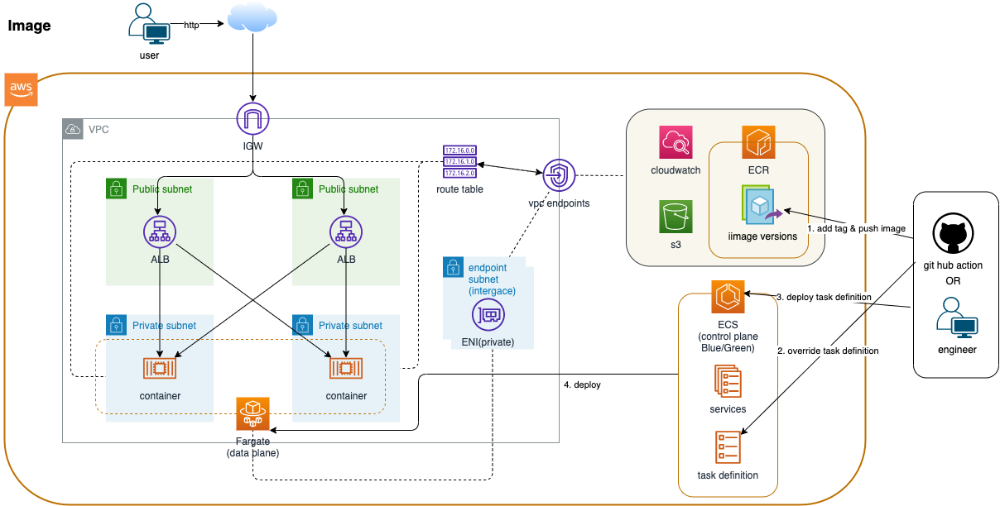

# Sample Computing ECS Fargate on ALB

Terraform Samples for ECS Fargate on ALB.

## Procedure

1. terraform apply with fargate_alb=false
1. push docker image into ecr
1. terraform apply with fargate_alb=true

## Fargate Deploy Helper

[deploy-fargate](https://github.com/tomoki171923/deploy-fargate)

## System Image

